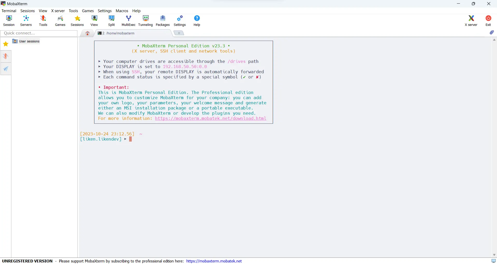
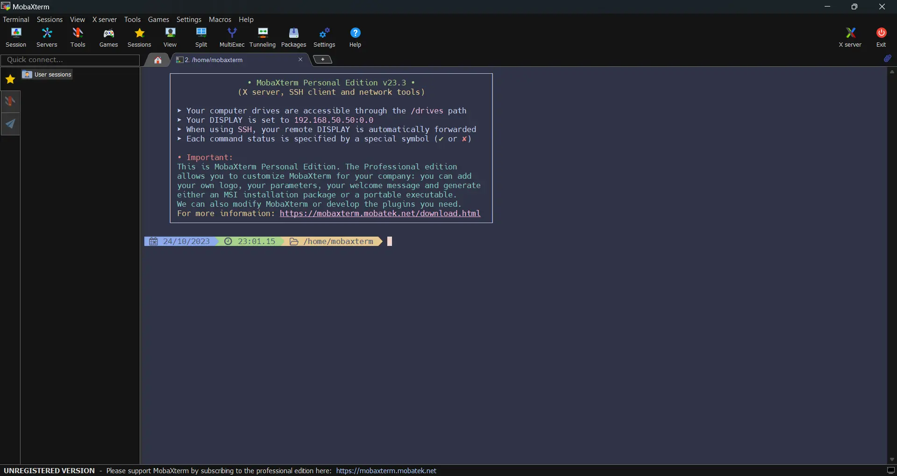
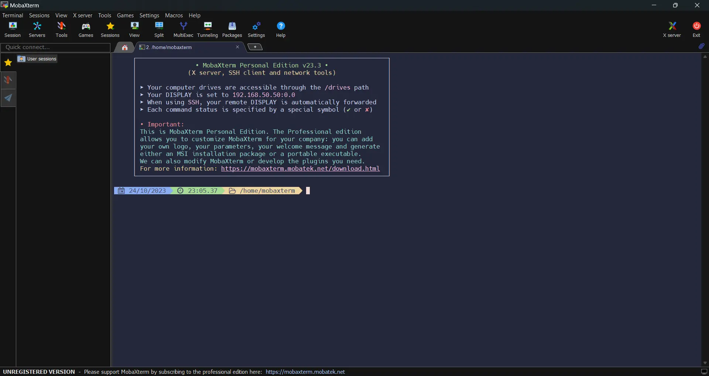
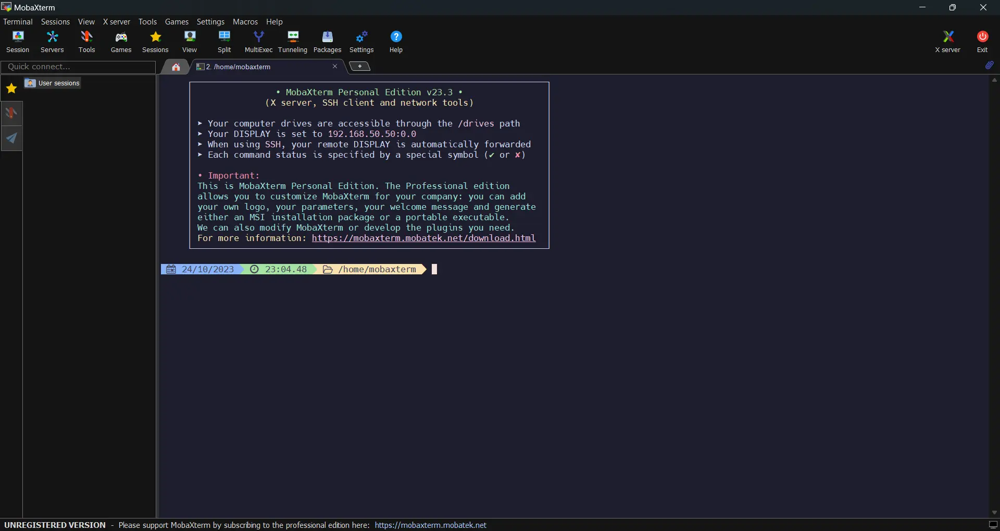

<h3 align="center">
	 
	
	Catppuccin for <a href="https://mobaxterm.mobatek.net/">MobaXterm</a>
	
</h3>

	
	
	

	

## Previews

🌻 Latte

🪴 Frappé

🌺 Macchiato

🌿 Mocha

## Usage

1. Download the flavor of your choice from [`themes/`](./themes/).
2. Go to **Settings** > **Configuration** > **Terminal** inside MobaXterm.
3. Click on **Default terminal color settings** > **Import a color theme from a file**.
4. Select the theme file downloaded in Step 1.
5. Restart MobaXterm.

### Manually

1. Open the Run dialog with <kbd>Win</kbd>+<kbd>R</kbd>.
2. Enter `shell:appdata\MobaXterm` into the dialog.
3. Edit the `MobaXterm.ini` file, replacing the `[Colors]` section with the configuration from your theme file of choice.

> [!IMPORTANT]
> Make sure MobaXterm is not running when you edit the `MobaXterm.ini` configuration file.

## 💝 Thanks to

- [likendev](https://github.com/likendev)

&nbsp;

	

	Copyright &copy; 2021-present <a href="https://github.com/catppuccin" target="_blank">Catppuccin Org</a>

	

